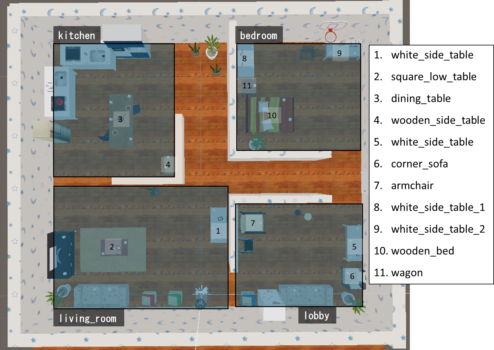
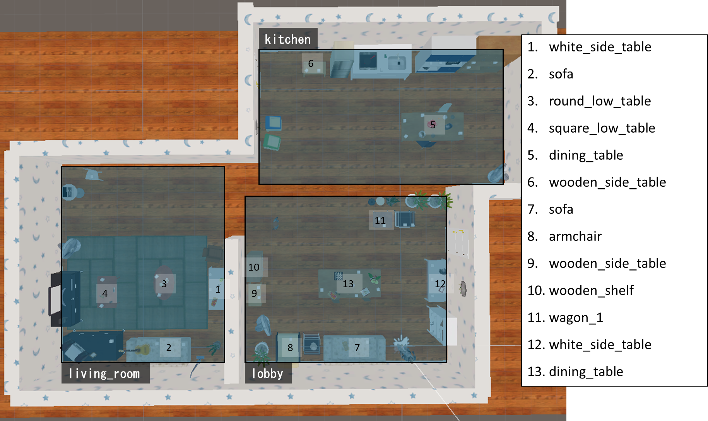

> [!WARNING]
> LayoutとLocation Listは今後更新される可能性があります。
>
# 環境レイアウトと把持・配置地点のリスト

# Layout2019HM01

## 把持・配置地点のリスト
### living_room
- white_side_table
- square_low_table

### kitchen
- dining_table
- wooden_side_table

### lobby
- white_side_table
- corner_sofa
- armchair

### bedroom
- white_side_table_1
- white_side_table_2
- wooden_bed
- wagon

# Layout2019HM02 (挑戦課題)

## 把持・配置地点のリスト
### living_room
- white_side_table
- round_low_table
- square_low_table

### kitchen
- dining_table
- wooden_side_table

### lobby
- armchair
- wooden_side_table
- wooden_shelf
- wagon_1
- white_side_table
- dining_table
