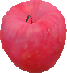

> [!WARNING]
> Object Listは今後更新される可能性があります。

# 把持物体リスト

| # | 写真 | 名称 | 
| --- | --- | --- | 
| 01 |  | apple | 
| 02 |  | canned_juice | 
| 03 |  | cubic_clock | 
| 04 |  | filled_plastic_bottle | 
| 05 |  | matryoshka | 
| 06 |  | soysauce | 
| 07 |  | spray_bottle | 
| 08 |  | toy_penguin | 
| 09 |  | tumbler | 
| 10 |  | white_cup | 

# 透明物体リスト (挑戦課題)
| # | 写真 | 名称 | 
| --- | --- | --- | 
| 01 |  | empty_ketchup | 
| 02 |  | empty_plastic_bottle | 
| 03 |  | nursing_bottle | 
