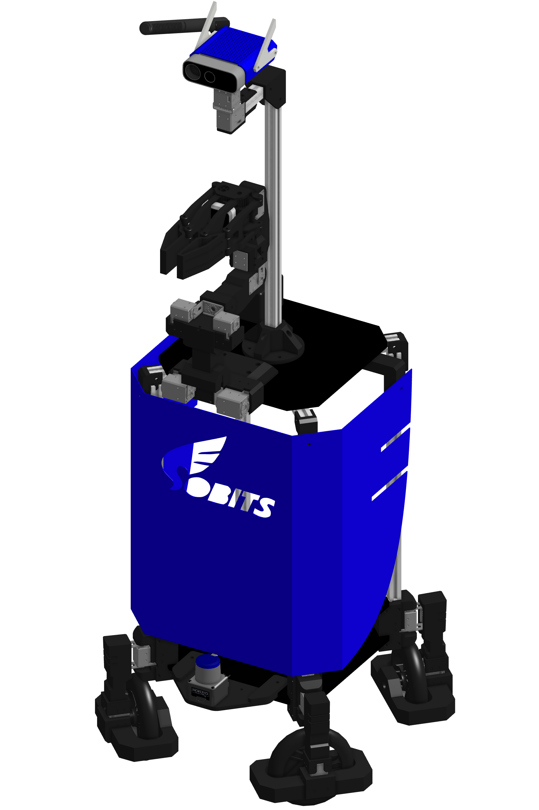
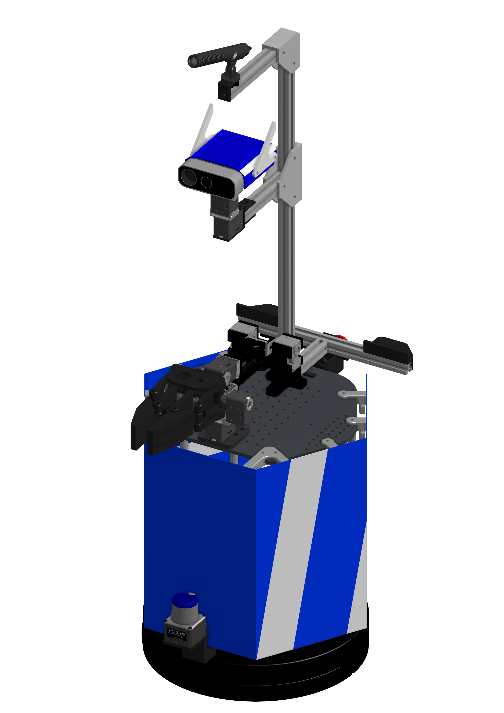
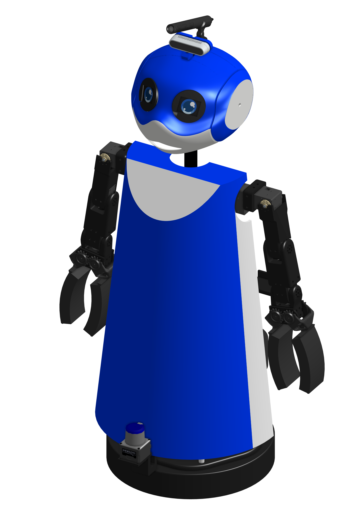
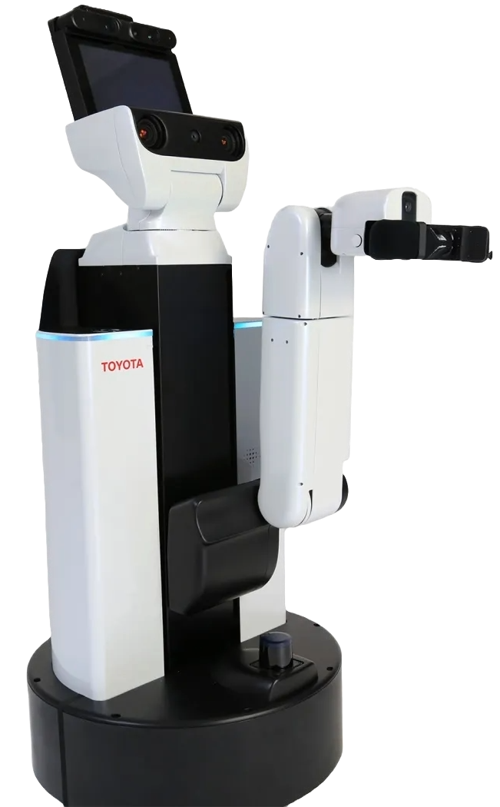
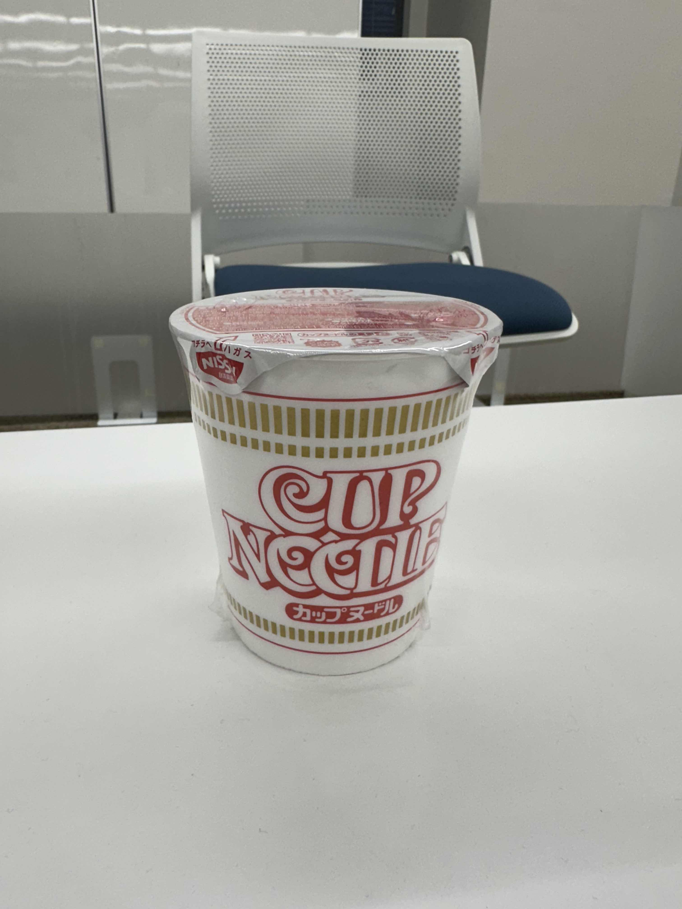
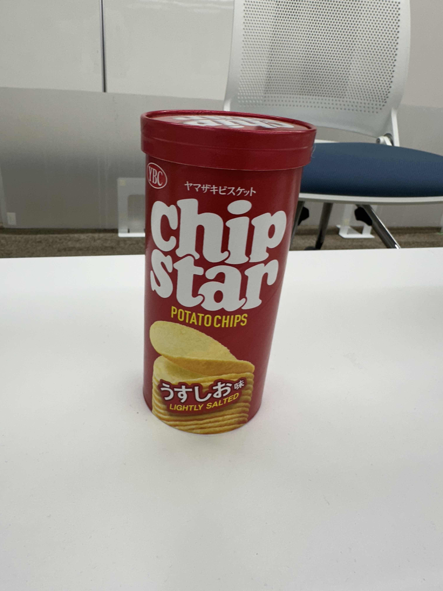
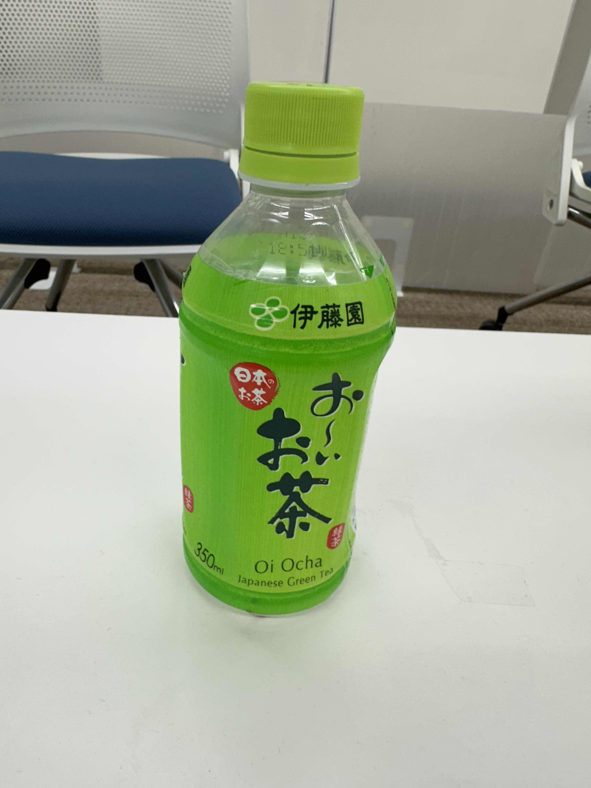
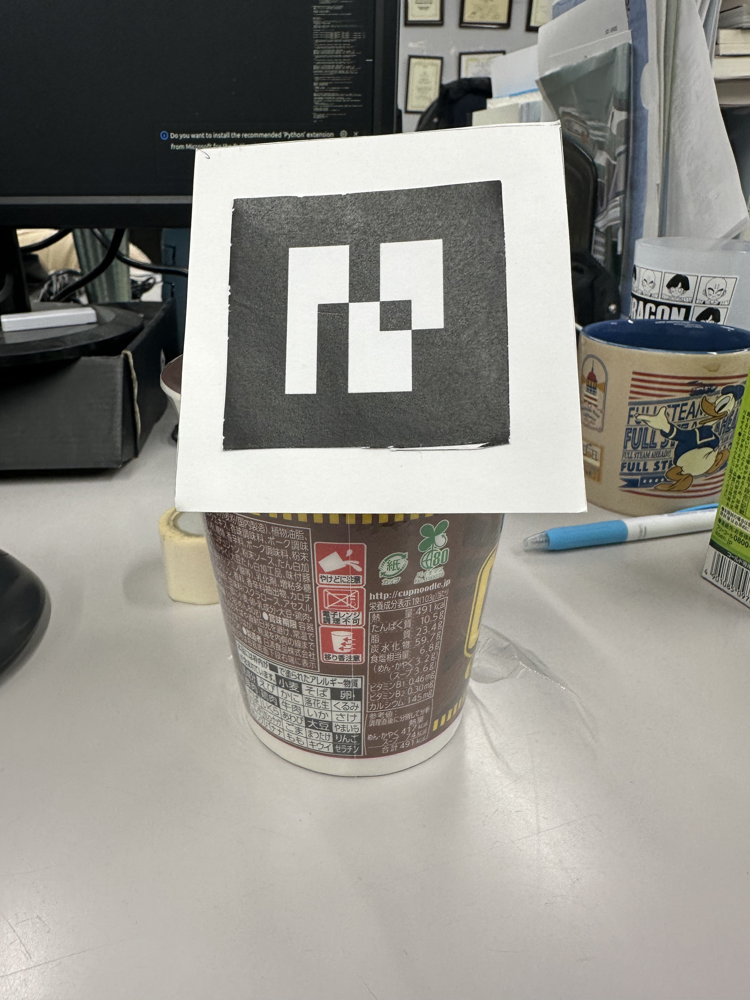
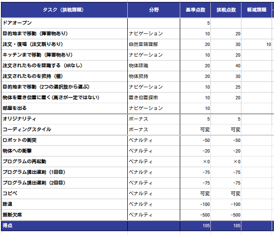

[日本語](README.md) | [English](README.en.md)

[![Contributors][contributors-shield]][contributors-url]
[![Forks][forks-shield]][forks-url]
[![Stargazers][stars-shield]][stars-url]
[![Issues][issues-shield]][issues-url]
[![License][license-shield]][license-url]

# RoboCup SOBITS Open Junior 2025

This repository provides various information and competition rules for participants in the RoboCup SOBITS Open Junior competition.

## Competition Overview

SOBITS participates annually in the “RoboCup Japan Open @Home League.” The RoboCup SOBITS Open Junior is designed to serve as an entry point into robot development, where students gain experience in programming through case study learning.

Participation in this competition is mandatory for all students enrolled in the Hagiwara Lab’s case study course. The event will be held during the 15th session of the course.

This competition aims to improve individual development skills. Therefore, each participant must develop their system independently. You may choose to develop the components yourself or use existing SOBITS packages.

Mentors and seniors will not provide direct technical guidance for this competition. You are encouraged to take initiative and work independently.

Success in this competition requires not only technical skills but also the ability to overcome challenges, planning skills to manage deadlines, and execution skills to follow through with plans. We hope the RoboCup SOBITS Open Junior provides you with opportunities to build these essential skills for your future research endeavors.

Let’s make this competition a great opportunity to learn and grow together, regardless of lab or school affiliation! We also hope your experience here will lead to advanced development in RoboCup SOBITS Open or the RoboCup Japan Open @Home League 2026.

## Competition Information

**RoboCup SOBITS Open Junior 2025**  
Organizer: Hagiwara Laboratory, Competition Operations Team  
Date: July 16  
Participants: All students enrolled in the Hagiwara Lab case study course  
Location: [Soka University, Faculty of Science and Engineering, Room F405](https://www.soka.ac.jp/access/)

## Resources Related to RoboCup SOBITS Open Junior

Slides explaining the competition can be found [here](https://docs.google.com/presentation/d/1iEyXjeYyGtTY0rmEQFcdXy2bd0PvROMXHSKK5Gc2SIc/edit?slide=id.gd431007ba2_0_208#slide=id.gd431007ba2_0_208).

If you have any questions, please do not ask the organizers directly. Instead, use the [Issue](https://github.com/TeamSOBITS/robocup_sobits_open/issues) page on GitHub.

## Competition Rules

- [Bring Me](rules/bm_ja.md)

## Detailed Information

- [Competition Environment](rules/layout_ja.md)
- [Object List](rules/objects_list_ja.md)
<!-- A summary of confirmed questions from prior Q&A or GitHub Issues -->

## Additional Advice

- [Recommended SOBITS Robots](rules/robots_ja.md)
- [Development Guide](rules/advice_ja.md)

# Updates & Change Log

<!-- 

競技環境情報まとめ

## 使用するレイアウト
競技はE301で行います．簡単なレイアウトは以下の図のようになります．

※挑戦課題（障害物あり）を選択した場合，キッチンがある方の部屋のみに配置されます．  
※挑戦課題（2つの選択肢から選ぶ）を選択しなかった場合，お客は一人になり，右側のみに座ります．  

## 使用可能ロボット

使用可能ロボット情報まとめ

SOBITS Commonのレポジトリでは，SOBITSがこれまで開発してきた実機ロボットを動かすため，共通のライブラリです．ロボットに搭載されているアクチュエータやセンサーなど共通で使用するリソースを統一し，ライブラリ化となったものです．

SOBITS Commonが必要とされるSOBITSのロボットはこちらになります．

| SOBIT PRO | SOBIT EDU | SOBIT MINI | HSR |
| :---: | :---: | :---: | :---: |
|  |  |  |  ___________|
| [Gitへ移動](https://github.com/TeamSOBITS/sobit_pro) | [Gitへ移動](https://github.com/TeamSOBITS/sobit_edu) | [Gitへ移動](https://github.com/TeamSOBITS/sobit_mini) | |

## 使用するオブジェクトについて

使用オブジェクト情報まとめ

今回のSOBITS OPENでは以下の物体を使用します．
|　カップヌードル | ポテトチップス | お茶 |
| :---: | :---: | :---: | 
|  |  |  |
| ar_marker_0 | ar_marker_1 | ar_marker_2 | 
|  |  |  |

物体認識時にar_markerを使用する際，以下のように物体に貼り付けられます．

※挑戦課題に挑戦する際は，学習データの提出が必須になります．
※戦課題に挑戦する際に，ログやコードをみて認識していないと判断した場合は認識の点数ははいりません．  

## 得点について

得点情報まとめ

得点については以下の表を参考にしてください．

※２回目の目的地まで移動の際，２つの選択肢から選ぶことが挑戦課題として記載されていますが，これは１回目の目的地まで移動の際，２人の中から手を上げている人を検出できた場合に加点されます．  

## 挑戦課題がある課題
#### ナビゲーション✕２
共通課題：障害物がない状態でナビゲーション  
挑戦課題：障害物がある状態でナビゲーション  

### 注文  
共通課題：自然言語での注文  
例）ポテトチップスをください．ポテトチップスが欲しいです．  
挑戦課題：お客が注文を間違える可能性がある  
例）客「お茶をください．」  
    ロボット「注文はお茶でよろしいですか？」  
    客「いいえ」  
    ロボット「注文は何でしょうか？」  
    客「ポテトチップスにします．」  
軽減課題：商品の単語のみ  
例）客「お茶！」  

### 物体認識
共通課題：ARマーカーを使用して認識  
挑戦課題：学習データを用いた認識  
        （実際に学習用のデータセットも要提出）  
※ログをみて認識していなかった場合は認識の点数ははいりません．  

### 物体把持
共通課題：机の上の物体を把持  
挑戦課題：棚の上の物体を把持  

※棚の高さはそれぞれのロボットが把持する時に，絶対に届かない位置には設定されない．  
※棚を選択した際，同じ高さに他の物体が存在する可能性がある．  

### 物体配置
共通課題：高さが一定の机に配置  
挑戦課題：高さが可変する状態での物体の配置  

※机の高さはそれぞれのロボットが配置する時に，絶対に届かない位置には設定されない．  

## 上記以外の点数区分
### 加点項目
#### オリジナリティ
ソースコードを見て，処理の工夫点が感じられた場合は，加点します．
#### コーディングスタイル
ソースコードのみやすさ，わかりやすさ，修正のしやすさなどが感じられた場合に加点します．

### 減点項目
#### コピペ
これまでのRoboCupのソースコード等のコピペが見受けられた際や，競技者同士でコピペの処理の部分があった場合は，その部分で達成したタスクの点数は0点になります．コピペの内容がひどい場合は更に減点される必要があります．

#### 衝突
ロボットの衝突や物体の衝突があった場合はその衝撃の度合いによって減点されます．
ロボットの衝突があった場合はその時点で競技を強制終了します．

#### 提出遅刻・辞退・無断欠席
減点されます．

## Q&A

Q&A情報まとめ

Q.dockerの使用は可能でしょうか？

A.参加する人は原則ローカルです。

Q.家庭環境に置く障害物の位置はランダムであるということでしたが、障害物そのもの種類などはランダムになりますか？

A.障害物に銀色のポールは確定です。ただランダムと言ってもキッチン側の部屋に置かれることは確定しています。また障害物によって、タスクが絶対にクリアできないと言ったことはないです。

Q.ロボットが人から注文を受ける時、ロボットはメニューを既に知っている状態ですか？

A.今後状況によって変動する可能性はありますが、現状ポテトチップス・お茶・カップヌードルになります。

Q.会話の挑戦課題について商品の単語そのまま注文されますか？
例:ポテトチップスをください→ポテチください

A.物体の名称は必ず発話されます。
略称等で発話されることはありません。

Q.障害物の挑戦課題について質問です
商品を認識するときや、ドアから出るときのために設定した登録地点上に障害物が配置される可能性に対しての配慮はありますか？

A.地点登録による各々の若干の誤差には影響がない位置に置きます。
そのため、sobit navigation stackのREADME通りに使う場合(ROBOCUP同様の使い方をする場合)、影響はありません。
しかし、オリジナル点を狙いにいく戦術や方法によって影響が出てしまう場合については考慮しません。自己責任となります。

Q.今回のSOBITS-OPENでは制限時間はありますでしょうか。
教えていただきたいです。よろしくお願いします。

A.その10分の間にリスタートは何回でも可能ですが、途中でリタイアをしない限り10分経過時点での獲得点数が得点となります。リスタートは緊急停止ボタンを押したのち、ドアオープン前の位置へ自分で戻していただきます。そのとき、得点は0点からのスタートとなります。リタイアは緊急停止ボタンを押す前に宣告してください。その時点での点数でストップし、そのトライアルの競技は終了となります。
※10分間のうちの一番高い点数ではないことに注意してください。

例1：8分経過時点で50点→リスタート→10分タイマー時点で40点
⇒そのトライアルは40点となる

例2：8分経過時点で50点→衝突前にリタイアを宣告
⇒そのトライアルは50点となり競技終了

Q.お客が1人の場合でも人検出は必要なのでしょうか？

A.必要ありません。客を1人として挑む場合は、左右どちらにいっても(または真ん中でも)、人とロボットがやり取りできる位置にロボットが移動していればそのまま競技の続行ができます。(もちろん手をあげている人判定の点数はスキップとなります)

Q.「依存関係」の詳細について伺いしてもいいでしょうか

A.依存関係がある得点については？
→ 物体配置は物体把持ができていることが前提
→ 目的地にたどり着いていないのに会話を始めてしまうとどちらの点数も入りません
(※お客の前に来ていないのに注文を聞いてしまう場合、お客は返事をしてくれない)
→ 注文で聞いた物体と違うものを把持した場合も聞いた物体でない限り点数は入りません(そのため物体の把持は物体の認識が前提)

物体の認識だけをする場合、ターミナルやUIなどでこちらが確認できる形にしてください

# 質問がある場合
## 競技ルールについての質問

ルールについての質問はDiscordのSOBITS RoboCup開発/OPEN/rulesの場で聞いてください．  
そこ以外での質問は受け付けません．
  
## エラー等についての質問

エラーやルール以外でわからないことがあった際は，すぐ先輩に聞くのではなく，なにを試したのか等を伝えた上で聞きましょう．  
質問された方も，簡単に教えるのではなく，何を試したのか等を聞いて，導きだす教え方をしていただけると助かります． 

# 追記情報
### [オブジェクト情報](#使用するオブジェクトについて)と[得点情報](#加点項目)を一部追加しました．(added 12.14.2023) -->

<!-- MARKDOWN LINKS & IMAGES -->
<!-- https://www.markdownguide.org/basic-syntax/#reference-style-links -->
[contributors-shield]: https://img.shields.io/github/contributors/TeamSOBITS/robocup_sobits_open.svg?style=for-the-badge
[contributors-url]: https://github.com/TeamSOBITS/robocup_sobits_open/graphs/contributors
[forks-shield]: https://img.shields.io/github/forks/TeamSOBITS/robocup_sobits_open.svg?style=for-the-badge
[forks-url]: https://github.com/TeamSOBITS/robocup_sobits_open/network/members
[stars-shield]: https://img.shields.io/github/stars/TeamSOBITS/robocup_sobits_open.svg?style=for-the-badge
[stars-url]: https://github.com/TeamSOBITS/robocup_sobits_open/stargazers
[issues-shield]: https://img.shields.io/github/issues/TeamSOBITS/robocup_sobits_open.svg?style=for-the-badge
[issues-url]: https://github.com/TeamSOBITS/robocup_sobits_open/issues
[license-shield]: https://img.shields.io/github/license/TeamSOBITS/robocup_sobits_open.svg?style=for-the-badge
[license-url]: LICENSE
