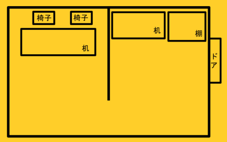
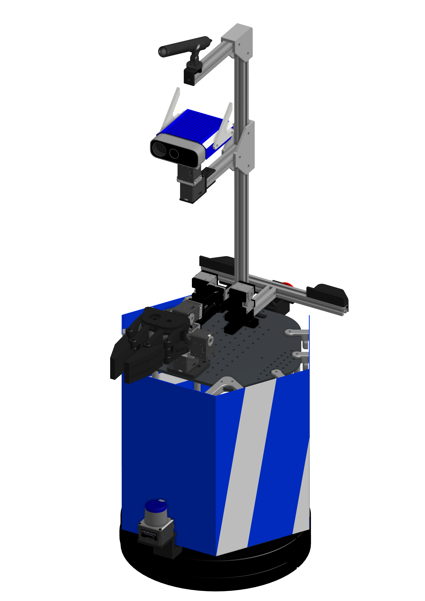
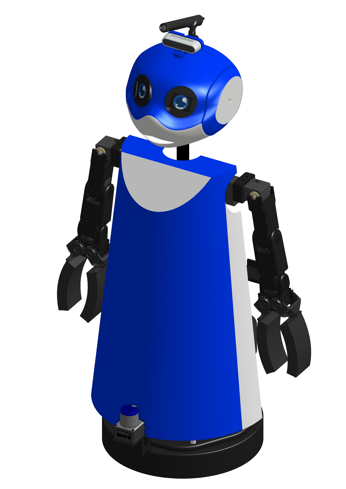
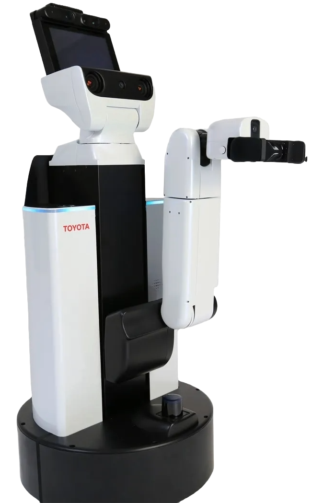
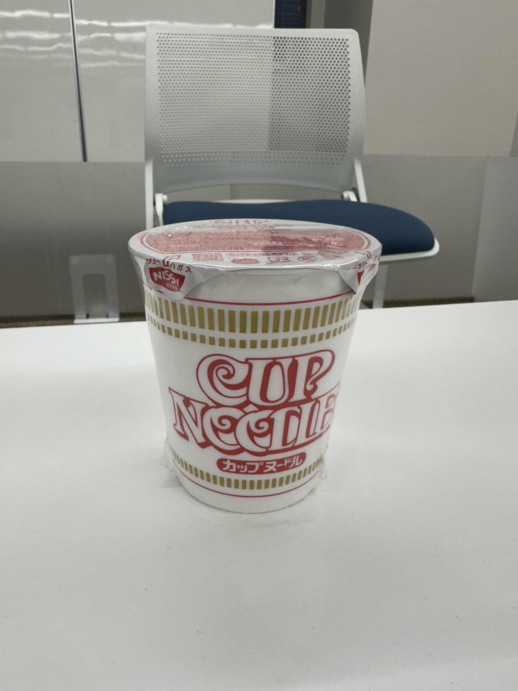
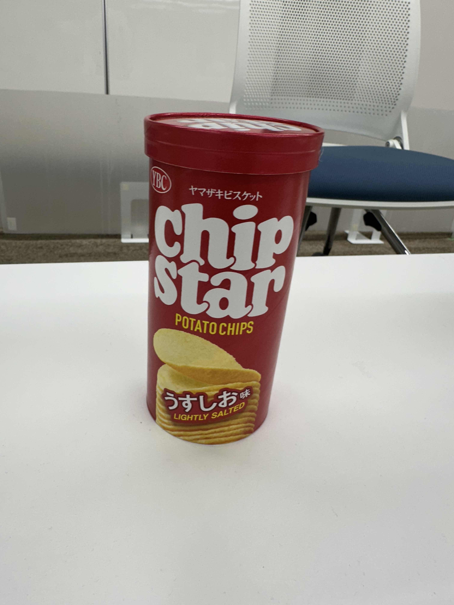
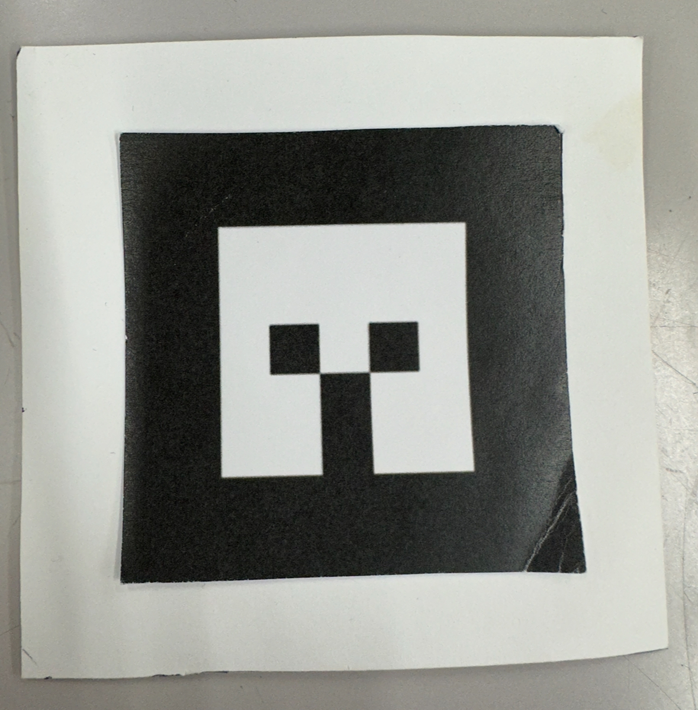
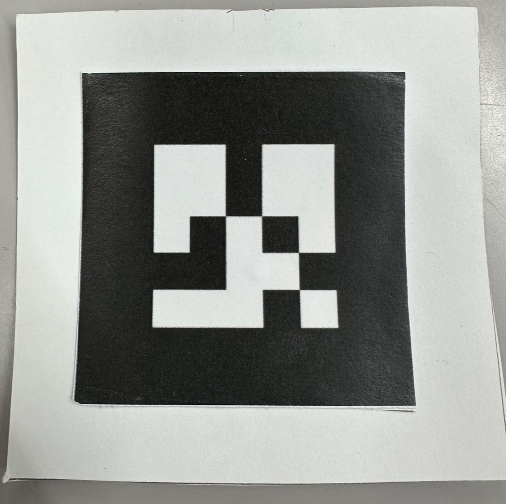
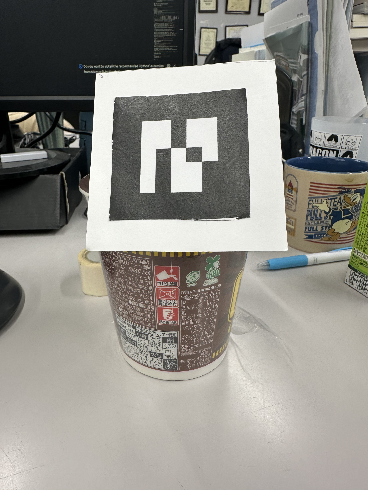

[JA](README.md) | [EN](README.en.md)

[![Contributors][contributors-shield]][contributors-url]
[![Forks][forks-shield]][forks-url]
[![Stargazers][stars-shield]][stars-url]
[![Issues][issues-shield]][issues-url]
[![License][license-shield]][license-url]

# **About RoboCup SOBITS Open Real Robot League**

We are SOBITS, we host "RoboCup SOBITS Open," a competition modeled after RoboCup. This competition's aim is to equip participants who have not participated in RoboCup with the skills necessary for robot development.

Here, we describe the "Real Robot League," where basic skills using actual robots are competed. Participation in the competition is optional, and those who wish to participate will compete according to the competition content described below. Although the development of the competition is done individually, each element technology used in the competition is organized as SOBITS packages. This makes it possible for beginners to challenge the competition on their own by mastering these elements. The competition generally does not provide approaches to development from seniors, so please actively take the initiative.

Furthermore, the results of this year's SOBITS OPEN2023 in Winter competition will have a significant impact on the member selection for RCJO2024 next year. If you are interested in participating in RCJO, please consider participating in this event.

Developing for this competition requires various skills, including the technical capability to realize functions, the breakthrough power when facing obstacles, the planning ability to advance development within a set deadline, and the action ability to execute that plan. I hope that "RoboCup SOBITS Open" can be a starting point for acquiring such skills and be beneficial for your future research life. Let's use this opportunity to significantly enhance Team SOBITS' development capabilities, aiming for victory at RoboCup held every year!

# **For Those Interested in Participation or Watching**

If you are interested in participating or watching SOBITS OPEN, please convey your interest to the following contact:  
**e1958209@gmail.com**

# **Documentation and Demo Videos**

Documents and demo videos presented during meetings are available on the server at /Competitions/RoboCup/RC2023_winter/slide. If you want to check, please do so from there.

For those without server permissions, please let us know, and we will send them to you.

# **Details of the Competition**
## **Competition Environment**

Summary of Competition Environment Information

## Layout Used
The competition will take place in E301. The basic layout is as shown in the figure below.

* If you choose the challenge task (with obstacles), it will only be placed in the room with the kitchen.
* If you do not choose the challenge task (choosing from two options), there will be only one customer who sits on the right side.

## **Available Robots**

Summary of Available Robot Information

SOBITS Common repository provides a common library for moving the robots developed by SOBITS so far. It unifies the resources commonly used in actuators, sensors, etc., mounted on robots and has been modularized as a library.

The robots for which SOBITS Common is required are as follows:

| SOBIT PRO | SOBIT EDU | SOBIT MINI | HSR |
| :---: | :---: | :---: | :---: |
|  |  |  |  ___________|
| [Move to Git](https://github.com/TeamSOBITS/sobit_pro) | [Move to Git](https://github.com/TeamSOBITS/sobit_edu) | [Move to Git](https://github.com/TeamSOBITS/sobit_mini) | |

## **Objects to be Used**

Summary of Objects Information

For SOBITS OPEN this time, the following objects will be used.

| Cup Noodles | Potato Chips | Tea |
| :---: | :---: | :---: | 
|  |  |  |
| ar_maker_0 | ar_maker_1 | ar_maker_2 | 
|  |  |  |

When using the ar_maker for object recognition, it is attached to the object as shown below.

* If you choose a challenge task, submitting learning data is required.
* When attempting a challenge task and not recognizing it by checking the logs or code, recognition points will not be awarded.

## **Scoring**

Summary of Scoring Information

Refer to the table below for scoring information.

* For the second destination movement, when choosing from two options is listed as a challenge task, this means that points will be added if someone raises their hand and is detected when moving to the first destination.

## Challenge Tasks
#### Navigation ✕ 2
Common Task: Navigation with no obstacles
Challenge Task: Navigation with obstacles

### Order
Common Task: Order in natural language  
Example: "Please give me potato chips. I want potato chips."   
Challenge Task: Possibility of the customer making a mistake in the order  
Example: Customer: "Tea, please."  
         Robot: "Is tea the correct order?"  
         Customer: "No."   
         Robot: "What is your order?"   
         Customer: "I'll have potato chips."  
Mitigation Task: Only words of the product   
Example: Customer: "Tea!"  

### Object Recognition
Common Task: Recognition using AR markers  
Challenge Task: Recognition using learning data  
                (Actual learning dataset must be submitted)  
* If not recognized by checking the logs, recognition points will not be awarded.  

### Object Grasping
Common Task: Grasping objects on the desk  
Challenge Task: Grasping objects on the shelf  

* The height of the shelf will not be set in a position that the robot cannot reach when grasping.
* When selecting the shelf, there may be other objects at the same height.

### Object Placement
Common Task: Placing objects on a desk with a fixed height  
Challenge Task: Placing objects in a state where the height is variable  

* The height of the desk will not be set in a position that the robot cannot reach when placing.

## Other Scoring Categories
### Bonus Items
#### Originality
Points will be added if ingenuity in processing is observed by looking at the source code.
#### Coding Style
Points will be added if the source code is easy to read, understand, and easy to modify.

### Deduction Items
#### Copy-Paste
If copy-pasting is observed in the source code from previous RoboCup code or if participants copy-paste sections of processing between themselves, the points for the task achieved in that section will be zero. Further deductions may occur for severe cases of copy-pasting.
#### Collisions
Points will be deducted based on the impact level if there are collisions between robots or objects. If a robot collision occurs, the competition will be forcibly terminated at that moment.
#### Late Submission, Withdrawal, Unexcused Absence
Points will be deducted.

# If You Have Questions
## Questions About Competition Rules

For questions about the rules, please ask in the #rules channel in SOBITS RoboCup Development/OPEN Discord. Questions asked elsewhere will not be accepted.

## Questions About Errors, Etc.

If there are errors or things you don't understand other than the rules, instead of asking seniors immediately, convey what you have tried, and then ask. Those being asked should not just provide a simple answer but inquire about what has been tried. Providing guidance based on that information would be appreciated.

# Added Information
### Added some [object information](#objects-to-be-used) and [scoring information](#scoring) (added 12.14.2023)

<!-- MARKDOWN LINKS & IMAGES -->
<!-- https://www.markdownguide.org/basic-syntax/#reference-style-links -->
[contributors-shield]: https://img.shields.io/github/contributors/TeamSOBITS/sobit_pro.svg?style=for-the-badge
[contributors-url]: https://github.com/TeamSOBITS/sobit_pro/graphs/contributors
[forks-shield]: https://img.shields.io/github/forks/TeamSOBITS/sobit_pro.svg?style=for-the-badge
[forks-url]: https://github.com/TeamSOBITS/sobit_pro/network/members
[stars-shield]: https://img.shields.io/github/stars/TeamSOBITS/sobit_pro.svg?style=for-the-badge
[stars-url]: https://github.com/TeamSOBITS/sobit_pro/stargazers
[issues-shield]: https://img.shields.io/github/issues/TeamSOBITS/sobit_pro.svg?style=for-the-badge
[issues-url]: https://github.com/TeamSOBITS/sobit_pro/issues
[license-shield]: https://img.shields.io/github/license/TeamSOBITS/sobit_pro.svg?style=for-the-badge
[license-url]: LICENSE