

[JA](README.md) | [EN](README.en.md)

[![Contributors][contributors-shield]][contributors-url]
[![Forks][forks-shield]][forks-url]
[![Stargazers][stars-shield]][stars-url]
[![Issues][issues-shield]][issues-url]
[![License][license-shield]][license-url]

# **RoboCup SOBITS Open Real Robot Leagueについて**

SOBITSでは，RoboCupを模した競技会である「RoboCup SOBITS Open」を開催しています．
これは，RoboCupに出場したことのないメンバーのみなさんに，ロボットに関する開発に必要な力を身につけてもらうことを目的とした競技会になります．

ここでは，実機を用いた基本的な技能を競い合う「real robot League」について述べます．
競技会への参加は任意ですので，参加したいと思う方のみで，後述する競技内容に従って競っていただきます．
競技の開発は1人で行ってもらいますが，競技で用いる1つ1つの要素技術はSOBITSのパッケージとしてまとめられており，それらを使いこなすことで初学者の方でも充分に1人で挑戦できる競技内容になっています．
本競技会は，基本的に先輩から開発に関するアプローチは行いませんので，主体的に行動するよう心掛けて下さい．

また，今回のSOBITS OPEN2023 in Winterの競技結果は，来年度のRCJO2024のメンバー選考に大きく影響します. 
もしRCJOに参加してみたいと思うメンバーは是非参加してみてください．

本競技会での開発には，機能を実現する技術力はもちろん，壁にぶつかったときの突破力や，期限が決まった中で開発を進める計画力，その計画を実行する行動力など，様々な力が必要になります．
この「RoboCup SOBITS Open」が，このような力を身に付けるきっかけとなって，みなさんの今後の研究生活に役立てることができると，とても嬉しく思います．
そして，毎年開催されるRoboCupでの優勝を目指して，チームSOBITSの開発力をグッと高める機会にしていきましょう！！

# **参加や観戦に興味がある方**
SOBITS OPENの参加や観戦に興味がある人は以下の連絡先にその旨をお伝えください．  
**e1958209@gmail.com**

# 資料やデモ動画について

ミーティングの時に発表した資料やデモの動画に関してはサーバの/Competitions/RoboCup/RC2023_winter/slideに載せました．
確認したい人は，そこから確認してみてください．

サーバの権限がない人は，言ってもらえればこちらから送ります．

# 競技の詳細 
## 競技環境

競技環境情報まとめ

## 使用するレイアウト
競技はE301で行います．簡単なレイアウトは以下の図のようになります．

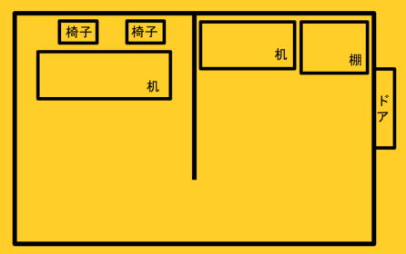

※挑戦課題（障害物あり）を選択した場合，キッチンがある方の部屋のみに配置されます．  
※挑戦課題（2つの選択肢から選ぶ）を選択しなかった場合，お客は一人になり，右側のみに座ります．  

## 使用可能ロボット

使用可能ロボット情報まとめ

SOBITS Commonのレポジトリでは、SOBITSがこれまで開発してきた実機ロボットを動かすため，共通のライブラリです．ロボットに搭載されているアクチュエータやセンサーなど共通で使用するリソースを統一し，ライブラリ化となったものです．

SOBITS Commonが必要とされるSOBITSのロボットはこちらになります．

| SOBIT PRO | SOBIT EDU | SOBIT MINI | HSR |
| :---: | :---: | :---: | :---: |
| 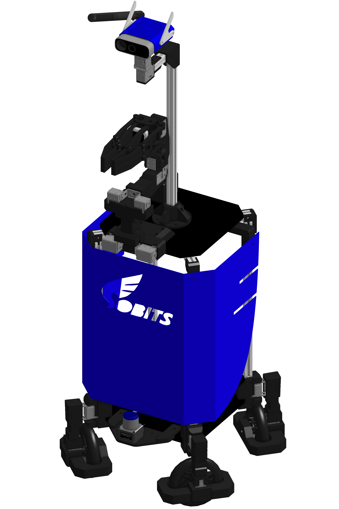 | 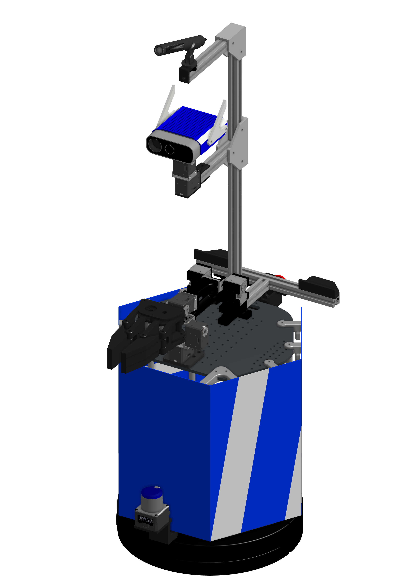 | 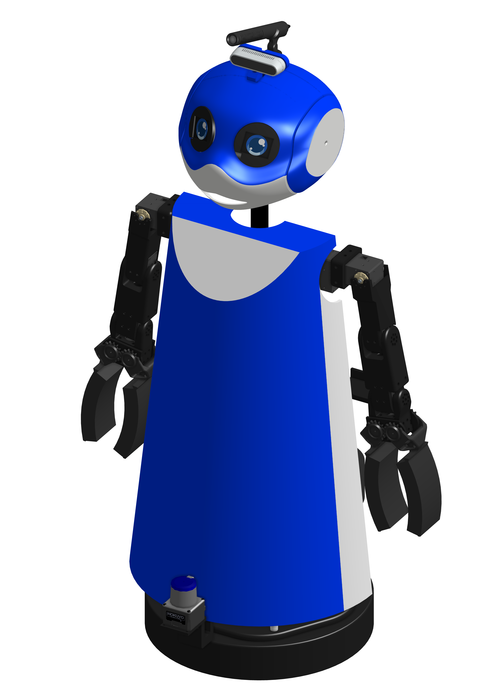 | 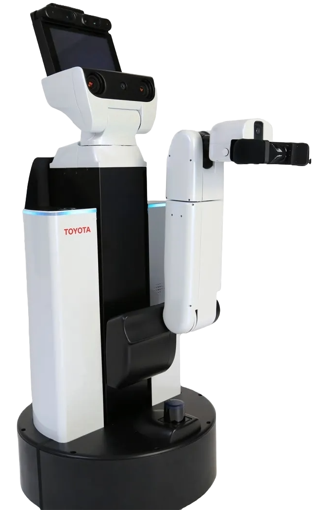 ___________|
| [Gitへ移動](https://github.com/TeamSOBITS/sobit_pro) | [Gitへ移動](https://github.com/TeamSOBITS/sobit_edu) | [Gitへ移動](https://github.com/TeamSOBITS/sobit_mini) | |

## 使用するオブジェクトについて

使用オブジェクト情報まとめ

今回のSOBITS OPENでは以下の物体を使用します。
|　カップヌードル | ポテトチップス | お茶 |
| :---: | :---: | :---: | 
| 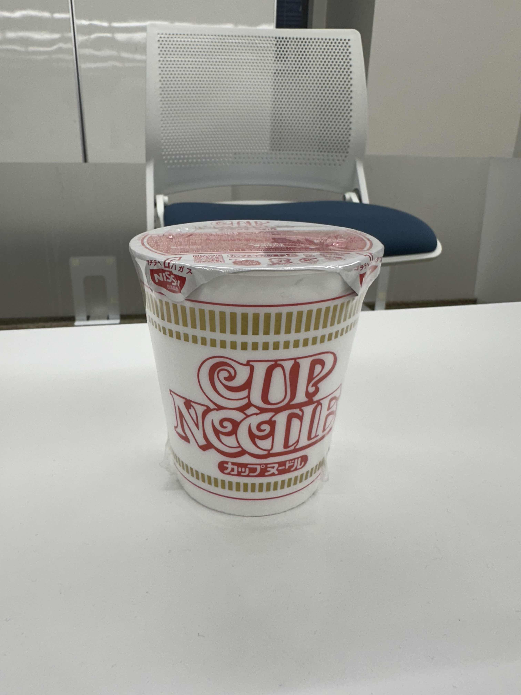 | 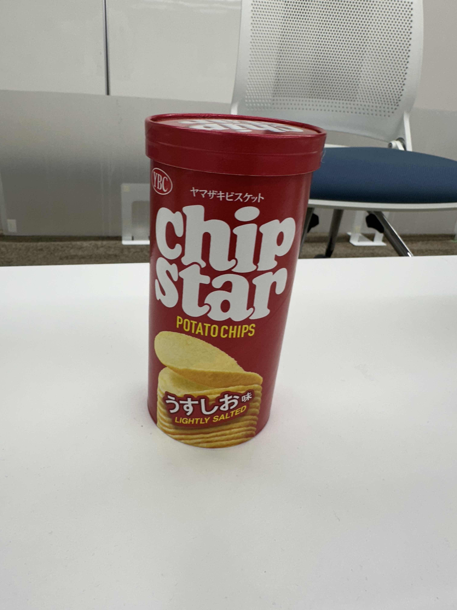 | 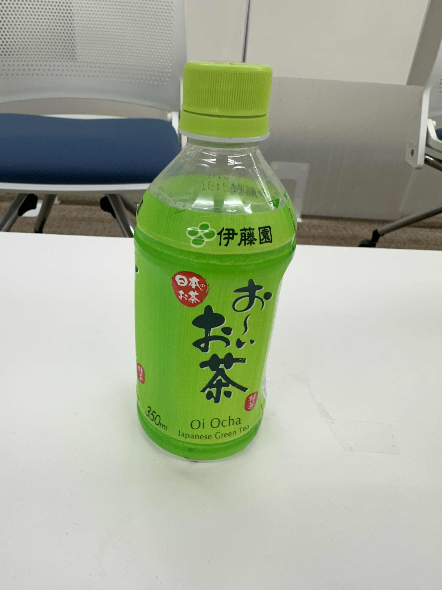 |
| ar_maker_0 | ar_maker_1 | ar_maker_2 | 
| 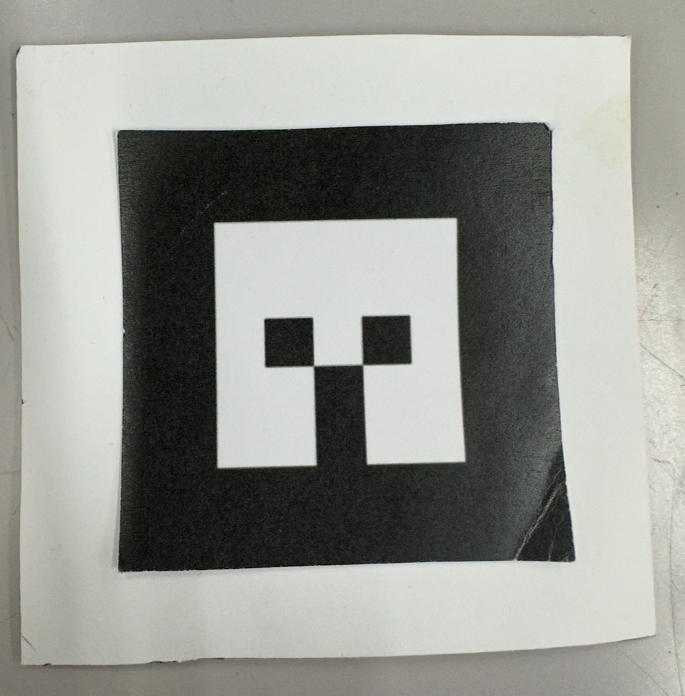 | 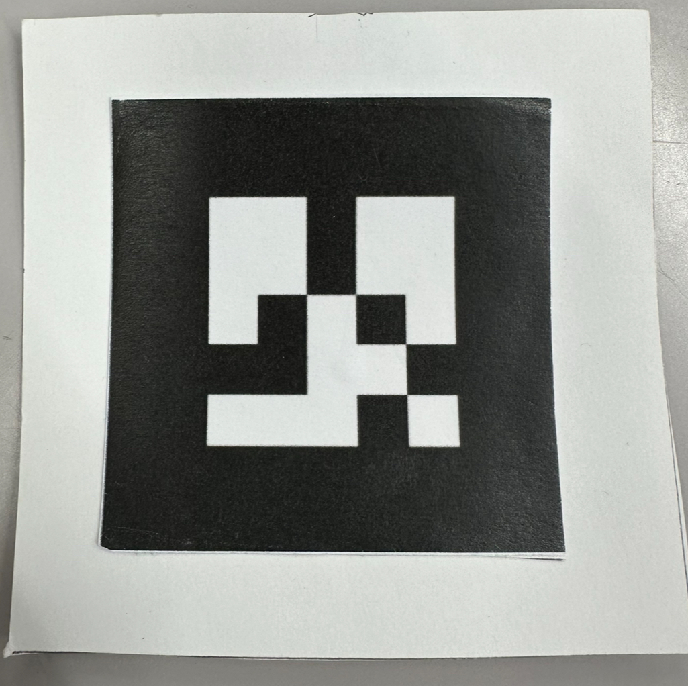 | 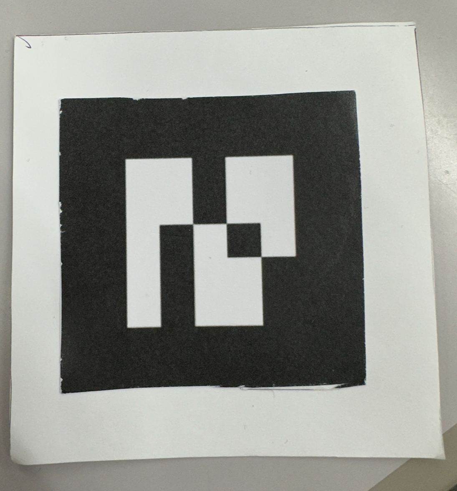 |

物体認識時にar_makerを使用する際、以下のように物体に貼り付けられます。

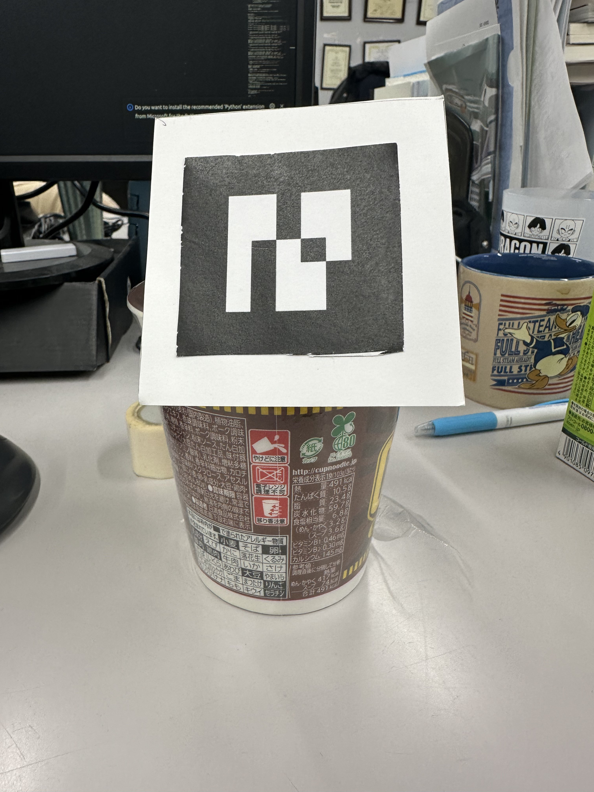

※挑戦課題に挑戦する際は、学習データの提出が必須になります。
※戦課題に挑戦する際に、ログやコードをみて認識していないと判断した場合は認識の点数ははいりません．  

## 得点について

得点情報まとめ

得点については以下の表を参考にしてください．

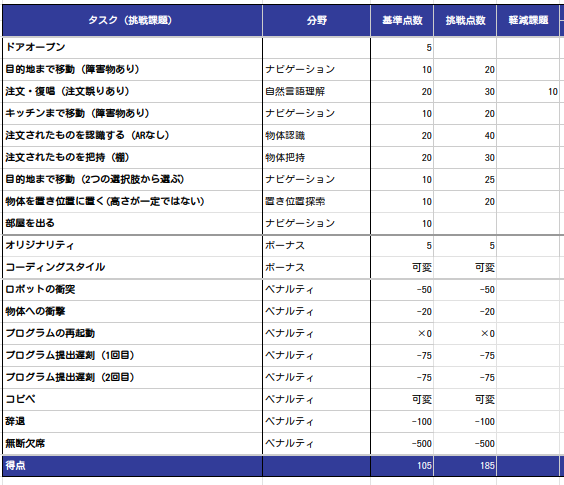

※２回目の目的地まで移動の際，２つの選択肢から選ぶことが挑戦課題として記載されていますが，これは１回目の目的地まで移動の際，２人の中から手を上げている人を検出できた場合に加点されます．  

## 挑戦課題がある課題
#### ナビゲーション✕２
共通課題：障害物がない状態でナビゲーション  
挑戦課題：障害物がある状態でナビゲーション  

### 注文  
共通課題：自然言語での注文  
例）ポテトチップスをください．ポテトチップスが欲しいです．  
挑戦課題：お客が注文を間違える可能性がある  
例）客「お茶をください．」  
    ロボット「注文はお茶でよろしいですか？」  
    客「いいえ」  
    ロボット「注文は何でしょうか？」  
    客「ポテトチップスにします．」  
軽減課題：商品の単語のみ  
例）客「お茶！」  

### 物体認識
共通課題：ARマーカーを使用して認識  
挑戦課題：学習データを用いた認識  
        （実際に学習用のデータセットも要提出）  
※ログをみて認識していなかった場合は認識の点数ははいりません．  

### 物体把持
共通課題：机の上の物体を把持  
挑戦課題：棚の上の物体を把持  

※棚の高さはそれぞれのロボットが把持する時に，絶対に届かない位置には設定されない．  
※棚を選択した際，同じ高さに他の物体が存在する可能性がある．  

### 物体配置
共通課題：高さが一定の机に配置  
挑戦課題：高さが可変する状態での物体の配置  

※机の高さはそれぞれのロボットが配置する時に，絶対に届かない位置には設定されない．  

## 上記以外の点数区分
### 加点項目
#### オリジナリティ
ソースコードを見て、処理の工夫点が感じられた場合は、加点します。
#### コーディングスタイル
ソースコードのみやすさ、わかりやすさ、修正のしやすさなどが感じられた場合に加点します。

### 減点項目
#### コピペ
これまでのRoboCupのソースコード等のコピペが見受けられた際や、競技者同士でコピペの処理の部分があった場合は、その部分で達成したタスクの点数は0点になります。コピペの内容がひどい場合は更に減点される必要があります。

#### 衝突
ロボットの衝突や物体の衝突があった場合はその衝撃の度合いによって減点されます。
ロボットの衝突があった場合はその時点で競技を強制終了します。

#### 提出遅刻・辞退・無断欠席
減点されます。

　

# 質問がある場合
## 競技ルールについての質問

ルールについての質問はDiscordのSOBITS RoboCup開発/OPEN/rulesの場で聞いてください．  
そこ以外での質問は受け付けません．
  
## エラー等についての質問

エラーやルール以外でわからないことがあった際は，すぐ先輩に聞くのではなく，なにを試したのか等を伝えた上で聞きましょう．  
質問された方も，簡単に教えるのではなく，何を試したのか等を聞いて，導きだす教え方をしていただけると助かります． 

# 追記情報
### [オブジェクト情報](#使用するオブジェクトについて)と[得点情報](#加点項目)を一部追加しました。(added 12.14.2023)

<!-- MARKDOWN LINKS & IMAGES -->
<!-- https://www.markdownguide.org/basic-syntax/#reference-style-links -->
[contributors-shield]: https://img.shields.io/github/contributors/TeamSOBITS/sobit_pro.svg?style=for-the-badge
[contributors-url]: https://github.com/TeamSOBITS/sobit_pro/graphs/contributors
[forks-shield]: https://img.shields.io/github/forks/TeamSOBITS/sobit_pro.svg?style=for-the-badge
[forks-url]: https://github.com/TeamSOBITS/sobit_pro/network/members
[stars-shield]: https://img.shields.io/github/stars/TeamSOBITS/sobit_pro.svg?style=for-the-badge
[stars-url]: https://github.com/TeamSOBITS/sobit_pro/stargazers
[issues-shield]: https://img.shields.io/github/issues/TeamSOBITS/sobit_pro.svg?style=for-the-badge
[issues-url]: https://github.com/TeamSOBITS/sobit_pro/issues
[license-shield]: https://img.shields.io/github/license/TeamSOBITS/sobit_pro.svg?style=for-the-badge
[license-url]: LICENSE
