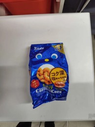
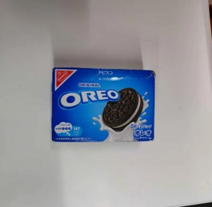
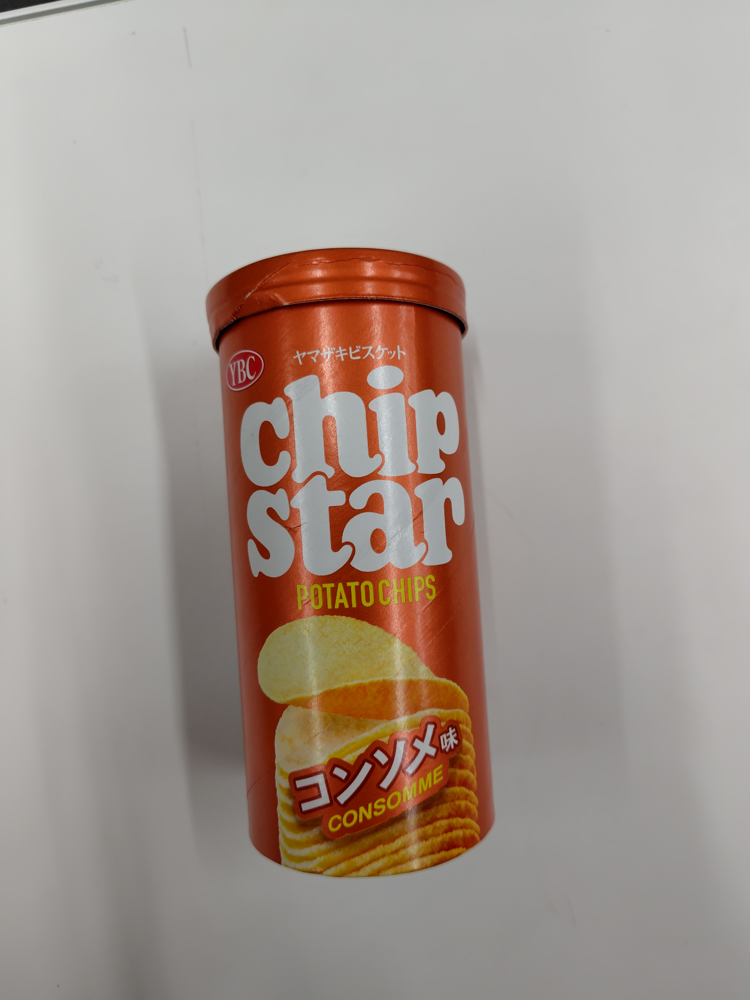
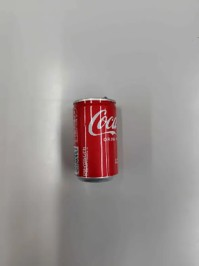
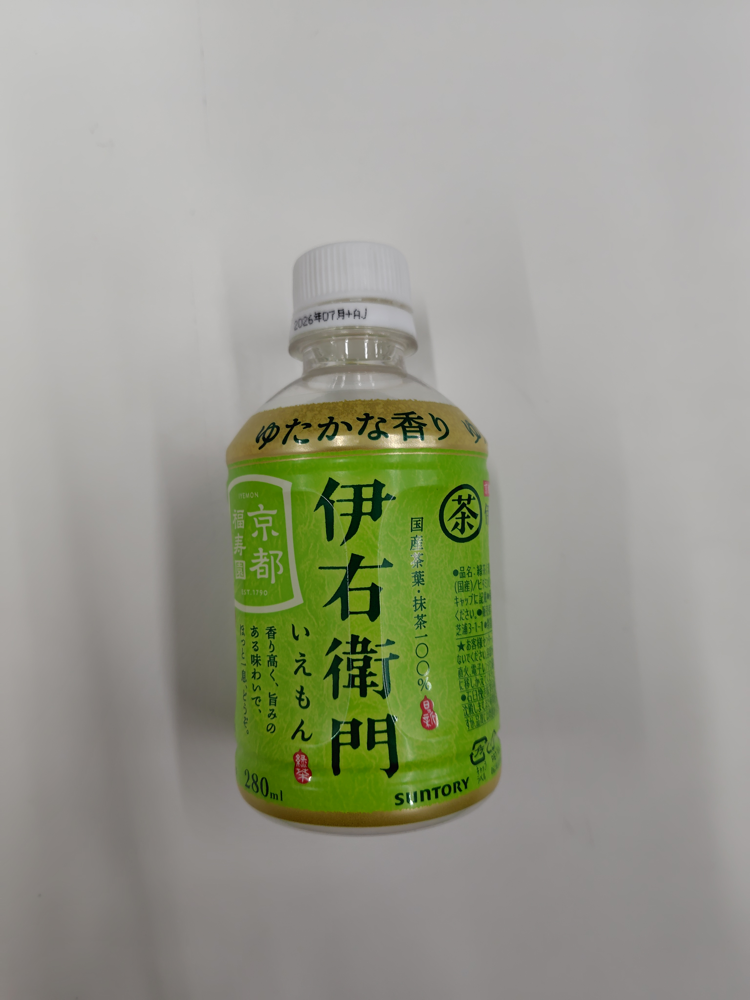
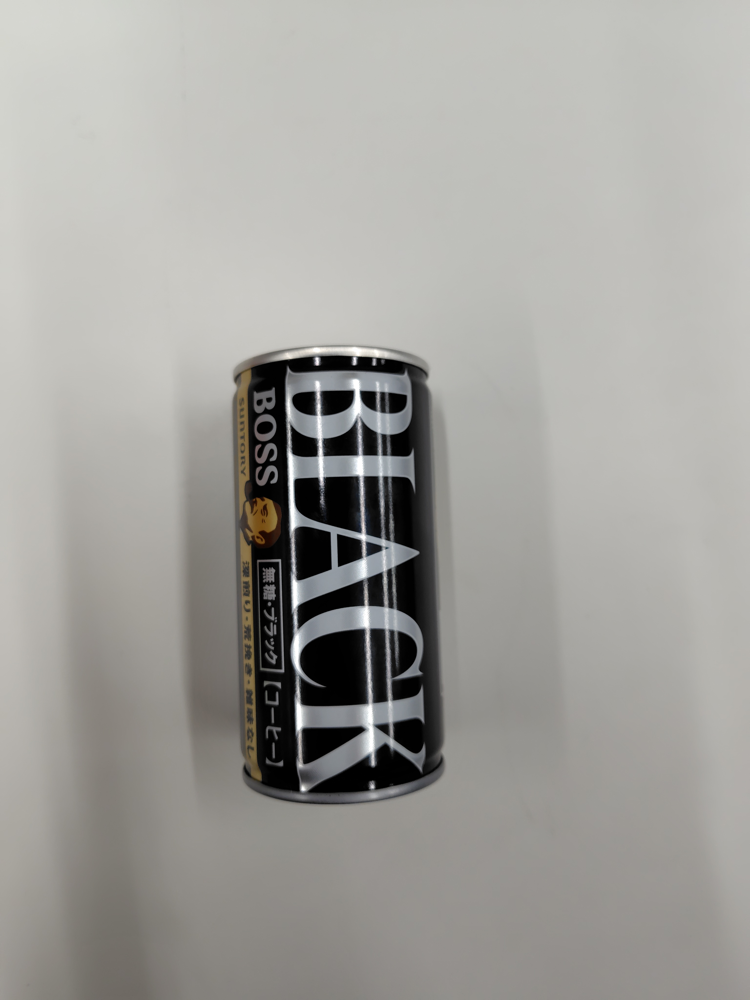
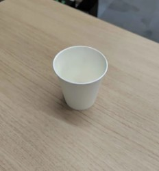
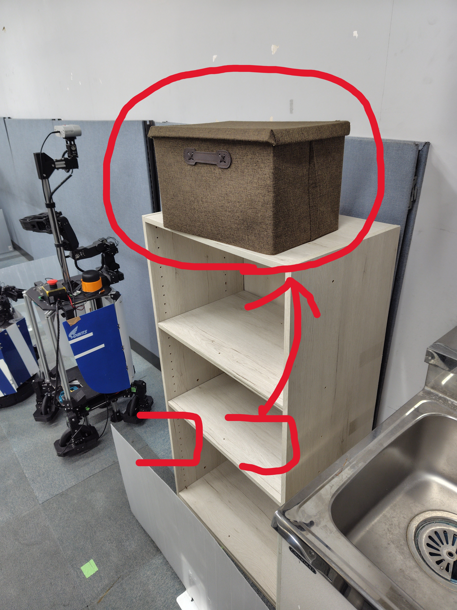
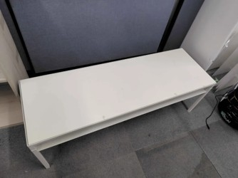
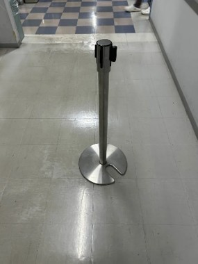

> [!WARNING]
>Listは今後更新される可能性があります。

# 把持物体リスト（共通課題）

| # | 写真 | 名称（カテゴリ） | 
| --- | --- | --- | 
| 01 |  | caramel_corn（snack） | 
| 02 |  | cookie（snack） | 
| 03 |  | potato_chips（snack） | 
| 04 |  | cola（drink） | 
| 05 |  | green_tea（drink） | 
| 06 |  | coffee（drink） | 

# 把持物体リスト (挑戦課題)
| # | 写真 | 名称（カテゴリ） | 
| --- | --- | --- | 
| 01 |  | water（drink） | 

ここで表示しているオブジェクトはF709教室にある以下の画像の場所に置いてあります。

# 家具リスト (共通課題)
| # | 写真 | 名称（カテゴリ） | 
| --- | --- | --- | 
| 01 |  | customer's_desk（desk） | 
| 02 |  | white_side_table（desk） | 
| 03 |  | customer's_chair（chair） | 

# 家具リスト (挑戦課題)
| # | 写真 | 名称（カテゴリ） | 
| --- | --- | --- | 
| 01 |  | belt_pole（obstacles） | 
