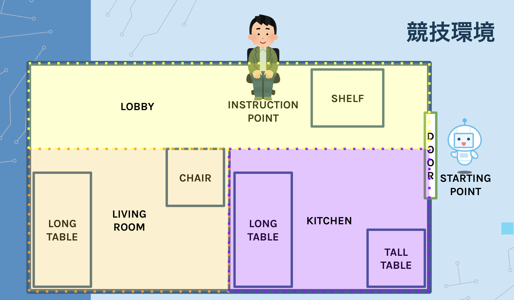
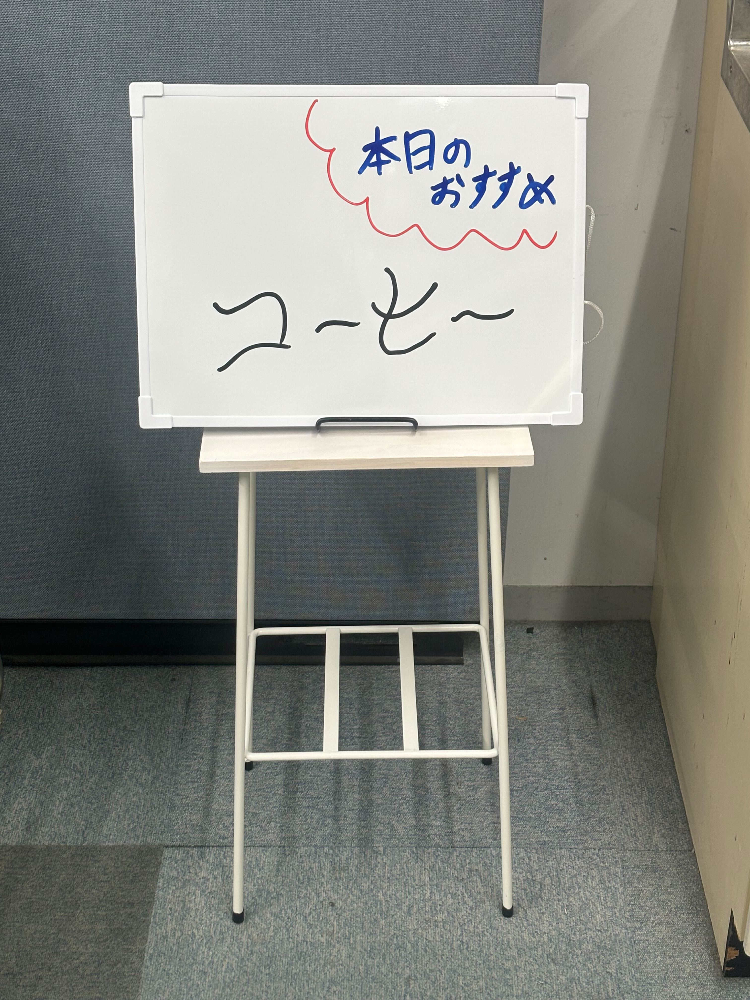
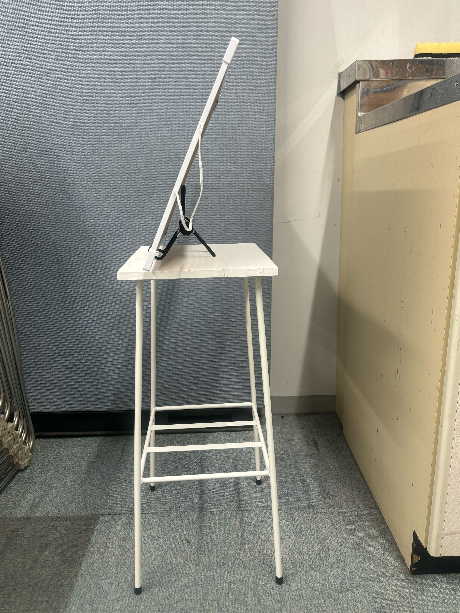
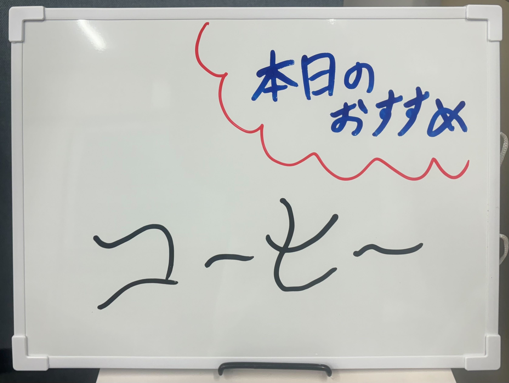

[日本語](layout_ja.md) | [English](layout_en.md)

# 本大会に使用される競技環境（アリーナ）

## 全体図

RoboCup SOBITS OPEN Beginner 2025で使用されるアリーナは以下の画像のようになります．\

## 各家具
COMINNG SOON!!
<!-- 
- イス

    特に指定しない．\
    0.50\[m\]四方の高さ0.60\[m\]程度のパイプ椅子などを使用する．

    こちら曖昧な家具となていますので，なにかご要望があれば教えてください．

- お客テーブル

    縦0.40\[m\]，横0.12\[m\]，高さ0.50\[m\]の白い表面のテーブルを用いる．\
    要望があれば，白から灰色の柄の面にすることも可能．

- キッチンテーブル

    [こちら(ナチュラル/ホワイト)](https://www.low-ya.com/goods/F402_G1034)のテーブルを用いる．\
    ただし2段目は外した状態とする．
    要望があればつけることもできる．

- 棚

    [こちら](https://www.nitori-net.jp/ec/product/8791521/)の棚を用いる．
    棚は段数は非公開とすることで難易度を高める．\
    ただし，ロボットのハードウェアによって難しい高さは出題されない．\
    つまり，SOBITSのロボット以外を使用する場合は，事前に高さを見させていただく可能性がある．

- 看板

    0.40\[m\]四方の高さ0.45\[m\]〜0.50\[m\]程度の高さの台に，以下の写真のようにホワイトボードを乗せて立て看板を再現する．

    
    

    ホワイトボードは[こちら]()を用いる．そして立てかけるために[こちらのスマホホルダー]()を用いる．\
    文字はOCによって書かれる．以下にその一例を示す．ただしこの通りに書かれるとは限らない．

    

    また，日本語か英語かは，選択することができる． -->
