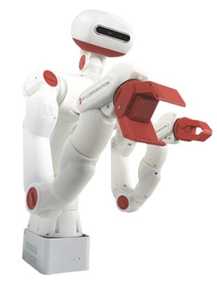

# 本大会に参加おすすめロボット

本大会はSOBITS主催の大会で，これらのロボットを基準に難易度設定をしております．\
そのため，これらのSOBITSが使用しているロボットの紹介をいたします\
また、下記以外のSOBITS自作ロボットを使用することも可能です。

| # | 名称 | 写真 |リンク|
| --- | --- | --- | --- |
| 01  | SOBIT LIGHT  (推奨プラットフォーム)|  |[Gitリンク](https://github.com/TeamSOBITS/sobit_light)|
| 02  | Sciurus 17   |  |[Gitリンク](https://github.com/rt-net/sciurus17_ros)|
| 03  | HSR          |  |[Gitリンク](https://github.com/TeamSOBITS/hsrb_robot/tree/humble)|
<!-- | 01 | SOBIT LIGHT |  |
| 02 | Sciurus 17 |  |
| 03 | HSR |  | -->